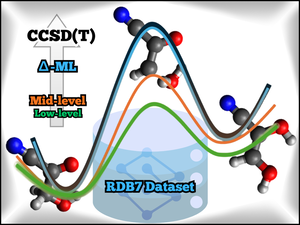

# ML Corrections for Barrier Heights (BH) & Reaction Enthalpies (RE)

[](https://colab.research.google.com/github/OmarRodriguezLopez1398/ML_corrections_BH_RE/blob/main/BH_RE_correction.ipynb)

<p align="center">
  
</p>

This repository provides machine learning (ML) correction models to improve **Barrier Height (BH)** and **Reaction Enthalpy (RE)** predictions using **MACE neural network potentials**.

The ML potentials implement a **Δ-learning strategy**, providing corrections from low- or mid-level QM calculations —**PM6**, **HF**, and **r²SCAN-3c**—toward higher-level quantum chemical references such as **DFT** and **CCSD(T)**.

A complete Google Colab workflow is provided to make the process easy and interactive.

---

## 🚀 Google Colab Notebook

You can run the entire workflow inside your browser using the following link:

👉 **[Open BH/RE Correction Notebook](https://colab.research.google.com/github/OmarRodriguezLopez1398/ML_corrections_BH_RE/blob/main/BH_RE_correction.ipynb)**

The notebook allows you to:

- Upload molecular structures (reactants, TS, and products).
- Visualize them in **3D** (via *NGLview*).
- Load pretrained **MACE** models from this repository.
- Evaluate structures and compute:
  - **Barrier Height corrections**
  - **Reaction Enthalpy corrections**

---

## 📁 Repository Structure

```text
ML_corrections_BH_RE
├── Models
│   ├── PM6
│   │   ├── PM6_CC_delta.model
│   │   └── PM6_DFT_delta.model
│   ├── HF
│   │   ├── HF_CC_delta.model
│   │   └── HF_DFT_delta.model
│   └── r²SCAN-3c
│       ├── r²SCAN-3c_CC_delta.model
│       └── r²SCAN-3c_DFT_delta.model
└── Dataset_results
    ├── GMTKN55
    ├── RDB7
    └── RGD1

```

## Models

### 🔹 PM6-based Δ-ML Corrections
- PM6 → CCSD(T)
- PM6 → DFT

### 🔹 HF-based Δ-ML Corrections
- HF → CCSD(T)
- HF → DFT

### 🔹 r²SCAN-3c-based Δ-ML Corrections
- r²SCAN-3c → CCSD(T)
- r²SCAN-3c → DFT

---
## Dataset Results

The folder **`Dataset_results/`** contains **Barrier Heights (BH)** and **Reaction Enthalpies (RE)** computed using our ML correction models on different benchmark datasets.

---
## Citation
If the codes and models help you, you can cite:
```
@article{xxxx,
  title         = {Efficient Machine Learning barrier height and reaction enthalpy corrections for low- and mid-level quantum mechanical calculations},
  author        = {Rodríguez López, Omar and Martínez Nuñez, Emilio and Vázquez, Saulo A. and Fernández ,Berta},
  year          = {xxxx},
  month         = xxx,
  journal       = {xxxx},
  publisher     = {xxxx},
  volume        = {x},
  number        = {x},
  pages         = {xxxxxxxxx},
  doi           = {xxxxx},
  issn          = {xxxx},
  url           = {xxxxx}
}
```
